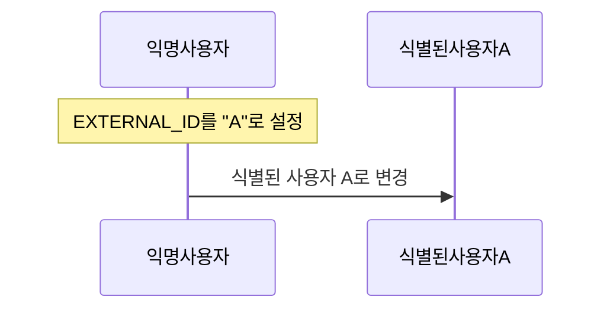
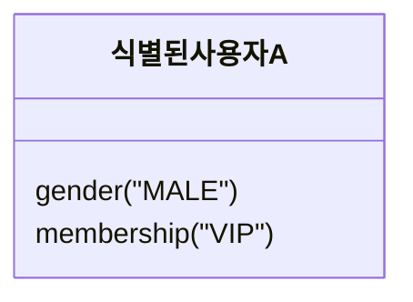
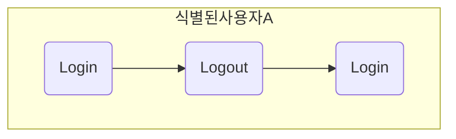
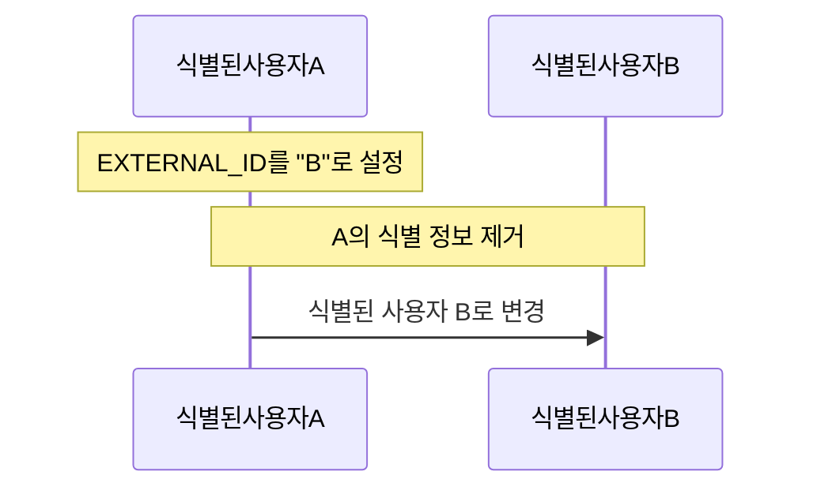
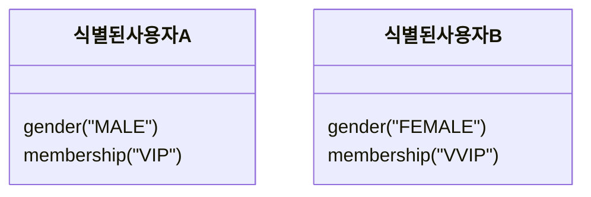
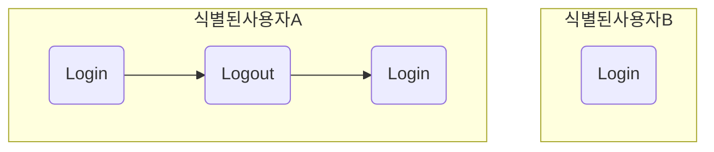

# 통합 ID 연동 시나리오

이 문서는 통합 ID 식별 정보 설정으로 인한 사용자 정보의 구성과 단말기 연결의 이해를 돕기 위해 가상의 시나리오를 예시로 들어 설명하는 문서입니다.

## 앱 최초 설치

SDK를 초기화를 위해 [SDK 설치](./SDK%20설치.md) 가이드를 참고해주세요.

## 사용자 로그인

이 섹션은 [익명의 사용자 프로필](#익명의-사용자-프로필) 상태에서 [식별된 사용자 프로필](#식별된-사용자-프로필)로 전환되는 과정을 보여줍니다. 

### 1. 통합 ID 식별 정보 설정하기

로그인 이벤트를 기록하기 전에 사용자를 구분할 값인 `EXTERNAL_ID` 값을 [통합 ID 식별 정보에 설정](./identity.md)해줍니다. 이 과정을 통해 해당 사용자는 [익명의 사용자 프로필](#익명의-사용자-프로필) 상태에서 [식별된 사용자 프로필](#식별된-사용자-프로필)로 전환되며 통합 ID가 생성되어 어떤 플랫폼에서든 이 사용자를 통합 ID를 통해 특정할 수 있게 됩니다.

```swift
Dfinery.shared().setIdentity(key: DF.IDENTITY_EXTERNAL_ID, value: "A")
//다른 식별 정보를 추가로 설정함으로써 사용자 식별의 정확도를 높일 수 있습니다.
Dfinery.shared().setIdentity(key: DF.IDENTITY_EMAIL, value: "jimmy.kang@igaworks.com")
Dfinery.shared().setIdentity(key: DF.IDENTITY_PHONE_NO, value: "821012345678")
...
```



### 2. 유저 프로필 설정하기
식별된 사용자 A에 해당하는 설정이 필요한 정보가 있을 경우 [유저 속성 정보](./Swift/유저%20속성%20정보.md)를 통해 반영합니다.

> [!TIP]
> 유저 속성 정보는 임의의 키 값을 사용자가 콘솔에서 설정해서 반영 가능합니다.

```swift
Dfinery.shared().setUserProfile(key: DF.USER_GENDER, value: DF.USER_GENDER_MALE)
Dfinery.shared().setUserProfile(key: DF.USER_MEMBERSHIP, value: "VIP")
...
```



### 3. 로그인 이벤트 기록하기
[이벤트를 기록](./Swift/이벤트.md)합니다. 

```swift
Dfinery.shared().logEvent(DF.EVENT_LOGIN)
```

## 사용자 로그아웃

이 섹션은 식별된 사용자 A가 로그아웃을 하는 과정을 보여줍니다.

### 1. 로그아웃 이벤트 기록하기

[이벤트를 기록](./Swift/이벤트.md)합니다. 

```swift
Dfinery.shared().logEvent(DF.EVENT_LOGOUT)
```

### 2. 통합 ID와 단말기의 연결 해제하기

만약 식별된 사용자 A가 로그아웃한 이후 A에 대해 액션이 타게팅이 되기를 원치 않을 경우 `suspendUserTargeting()` API를 호출함으로써 연결을 해제합니다.

> [!WARNING]
> 로그아웃 및 종료 후에도 개인화 메시지를 받고 싶으시다면 `suspendUserTargeting()` API를 호출하지 않아야 합니다.

```swift
Dfinery.shared().suspendUserTargeting()
```

이후 해당 단말기에는 식별된 사용자 A에 대해 액션이 타게팅되지 않습니다. 단, 단말기는 타겟팅 될 수 있으므로 전체 대상의 액션 혹은 단말기를 타겟으로 하는 메시지는 수신받게 됩니다.

 ## 기존 `EXTERNAL_ID`를 사용한 로그인
 이 섹션은 통합 식별 정보를 설정한 이력이 있는 사용자가 다시 같은 `EXTERNAL_ID` 값을 사용해서 로그인을 하는 과정을 보여줍니다.

 ### 1. 통합 ID 식별 정보 설정하기
 입력한 `EXTERNAL_ID` 값이 기존과 동일할 경우 기존에 생성되었던 식별된 사용자 A와 다시 단말기가 연결됩니다.

 ```swift
Dfinery.shared().setIdentity(key: DF.IDENTITY_EXTERNAL_ID, value: "A")
```

 ### 2. 로그인 이벤트 기록하기
 이벤트의 흐름 또한 기존과 마찬가지로 식별된 사용자 A의 이벤트 흐름이 계속해서 이어집니다.

```swift
Dfinery.shared().logEvent(DF.EVENT_LOGIN)
```


## 다른 `EXTERNAL_ID`를 사용한 로그인
이 섹션은 통합 식별 정보를 설정한 이력이 있는 사용자가 다른 `EXTERNAL_ID` 값을 사용해서 로그인을 하는 과정을 보여줍니다.

### 1. 통합 ID 식별 정보 설정하기
 입력한 `EXTERNAL_ID` 값이 기존과 다를 경우 SDK는 다른 사용자로 판단해서 기존에 저장하고 있었던 통합 ID 정보를 모두 삭제하고 새로 설정하게 되며 단말기가 식별된 사용자 B로 연결됩니다.

 ```swift
Dfinery.shared().setIdentity(key: DF.IDENTITY_EXTERNAL_ID, value: "B")
```



### 2. 유저 프로필 설정하기
유저 프로필은 식별된 사용자 B에 반영됩니다.

```swift
Dfinery.shared().setUserProfile(key: DF.USER_GENDER, value: DF.USER_GENDER_FEMALE)
Dfinery.shared().setUserProfile(key: DF.USER_MEMBERSHIP, value: "VVIP")
...
```


 ### 3. 로그인 이벤트 기록하기
 이벤트의 흐름은 새로이 식별된 사용자 B의 이벤트 흐름으로 변경됩니다.

```swift
Dfinery.shared().logEvent(DF.EVENT_LOGIN)
```


---

## 참고 자료

### 익명의 사용자 프로필
사용자 식별 정보를 설정하지 않았을 경우 사용자는 익명 사용자로 취급됩니다. 예를 들어 웹사이트에 방문했지만 가입하지 않았거나 모바일 앱을 다운로드 했지만 프로필을 만들지 않은 사용자가 될 수 있습니다. 

처음에 SDK를 통해 사용자가 인식되면 SDK에서 생성한 고유 식별자가 발급되어 익명의 사용자 프로필이 생성됩니다.

### 식별된 사용자 프로필 
식별 정보 유형 중 `DF.IDENTITY_EXTERNAL_ID` 값을 설정할 경우 Dfinery에서 식별된 사용자로 취급되며 여러 장치에서 동일한 사용자 프로필을 식별할 수 있게 됩니다. 또한 보다 명확한 사용자 식별을 위해 사용자 이메일, 전화번호 등의 정보를 추가로 설정할 수 있습니다.